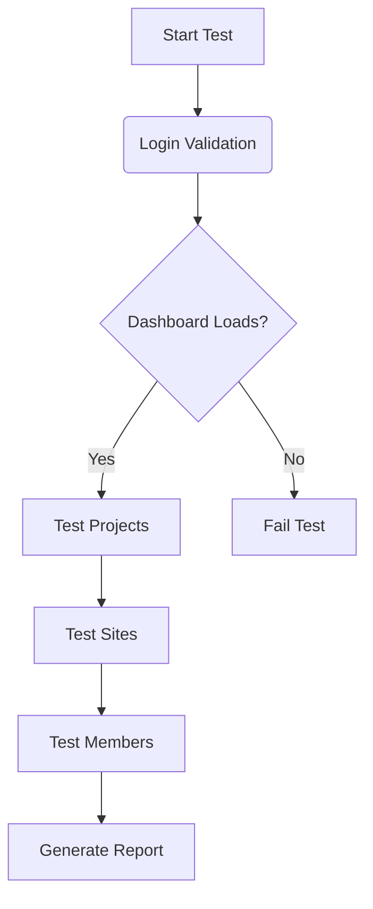

# 🖥️ UI Automation Testing Framework


## 🚀 Overview
A modular **UI Automation Framework** for web applications using Selenium, TestNG, and Java. Designed for end-to-end testing of critical workflows including:

- 🔐 Authentication flows
- 📊 Dashboard navigation
- 🏗️ Projects management
- 📍 Sites configuration
- ✅ Tasks operations
- 👥 Members management

## 🌟 Key Features
### 🛠️ Core Components
- **Selenium**: Browser automation & element interaction
- **TestNG**: Test orchestration & reporting
- **Page Object Model**: Reusable component structure
- **Parallel Execution**: Cross-browser testing support

### 📦 Framework Architecture
```bash
📦 src
├── 📂 main
│   └── 📂 java
│       ├── 📂 RemotelyFlows
│       │   ├── 📄 GoToMembers.java       # Members navigation
│       │   ├── 📄 GoToProjects.java      # Projects workflow
│       │   ├── 📄 GoToSites.java         # Sites management
│       │   └── 📄 LoginToWebsite.java    # Authentication flow
│       └── 📂 utils
│           ├── 📄 ConfigManager.java     # Configuration loader
│           ├── 📄 WebDriverManager.java  # Browser management
│           └── 📄 LoggerUtil.java        # Test logging
│
└── 📂 test
    ├── 📂 java
    │   └── 📂 TestWebsiteFlows
    │       ├── 📄 LoginTest.java        # Auth validation
    │       ├── 📄 DashboardTest.java    # Homepage checks
    │       ├── 📄 ProjectsTest.java     # Project workflows
    │       └── 📄 SitesTest.java        # Site configuration
    └── 📂 resources
        ├── 📄 TestNG.xml               # Test suites
        └── 📄 config.properties        # Environment config
```

## 🧪 Supported Test Scenarios

## 🛠️ Setup Guide
### 📋 Prerequisites :
☕ Java JDK 11+

🧰 Maven 3.8+

🌐 Browser Drivers

### ⚙️ Configuration :
#### config.properties template:
```properties
# 🌍 Environment
base.url=https://app.remotely.store
browser=chrome

# 🔑 Credentials
username=your_email@example.com
password=your_password
```

## 🚦 Test Execution
### IDE Execution
1.Right-click TestNG.xml

2.Select Run as TestNG Suite

### Command Line
```bash
# Run all tests
mvn clean test

# Run specific test group
mvn test -Dgroups="smoke"
```
## 📊 Test Reporting
### Sample TestNG HTML Report:
```plaintext
===============================================
Suite: Remotely Test Suite
Total tests run: 15, Failures: 0, Skips: 0
===============================================
```

## 🔧 Troubleshooting

### Issue	Solution
### 🔴 Driver Not Found	Verify driver versions match browser
### 🟡 Element Not Visible	Increase implicit waits in WebDriverManager
### 🔵 Configuration Errors	Check config.properties formatting

